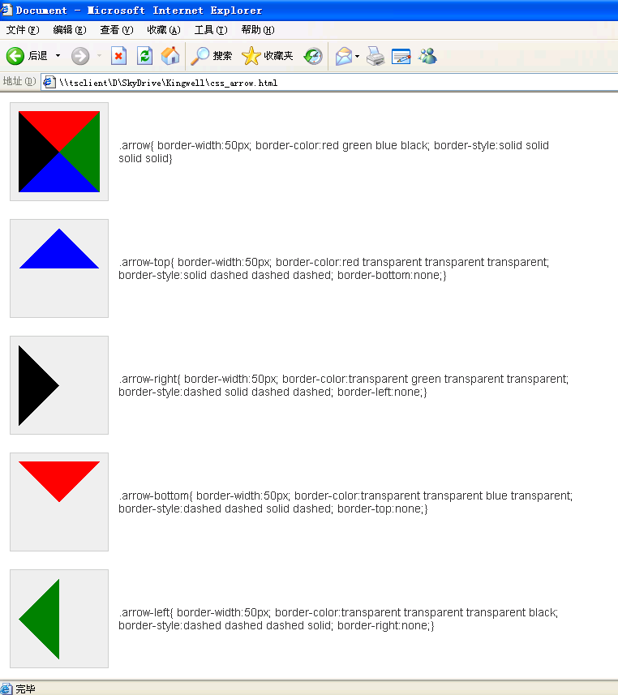

# CSS实现箭头效果 #

>有时候网页中使用箭头以增强效果，一般的做法是使用图片，今天我们使用CSSCSS来实现“箭头效果”，使用CSS我们必须兼容所有浏览器（IE6、7、8、9、10、+），Chrome，Firefox，Opear...

## Code ##

	<!doctype html>
	<html lang="en">
	<head>
	<meta charset="UTF-8">
	<meta name="Generator" content="Kingwell">
	<meta name="Author" content="Kingwell Leng">
	<meta name="Keywords" content="">
	<meta name="Description" content="">
	<title>Document</title>
	
	
	</head>
	<body>
	<table>
	    <tr>
	        <td>
	            

	                

	            

	        </td>
	        <td>
	        
.arrow{ border-width:50px; border-color:red green blue black; border-style:solid solid solid solid}

	        </td>
	    </tr>
	    <tr>
	        <td>
	            

	                

	            

	        </td>
	        <td>
	        
.arrow-top{ border-width:50px; border-color:red transparent transparent transparent;  border-style:solid dashed dashed dashed; border-bottom:none;}
	

	        </td>
	    </tr>
	    <tr>
	        <td>
	            

	                

	            

	        </td>
	        <td>
	        
.arrow-right{ border-width:50px; border-color:transparent green transparent transparent;  border-style:dashed solid dashed dashed; border-left:none;}
	

	        </td>
	    </tr>
	    <tr>
	        <td>
	            

	                

	            

	        </td>
	        <td>
	        
.arrow-bottom{ border-width:50px; border-color:transparent transparent blue transparent;  border-style:dashed dashed solid dashed; border-top:none;}
	

	        </td>
	    </tr>
	    <tr>
	        <td>
	            

	                

	            

	        </td>
	        <td>
	        
.arrow-left{ border-width:50px; border-color:transparent transparent transparent black;  border-style:dashed dashed dashed solid; border-right:none;}
	

	        </td>
	    </tr>
	</table>
	
	</body>
	</html>

## 效果图 ##
